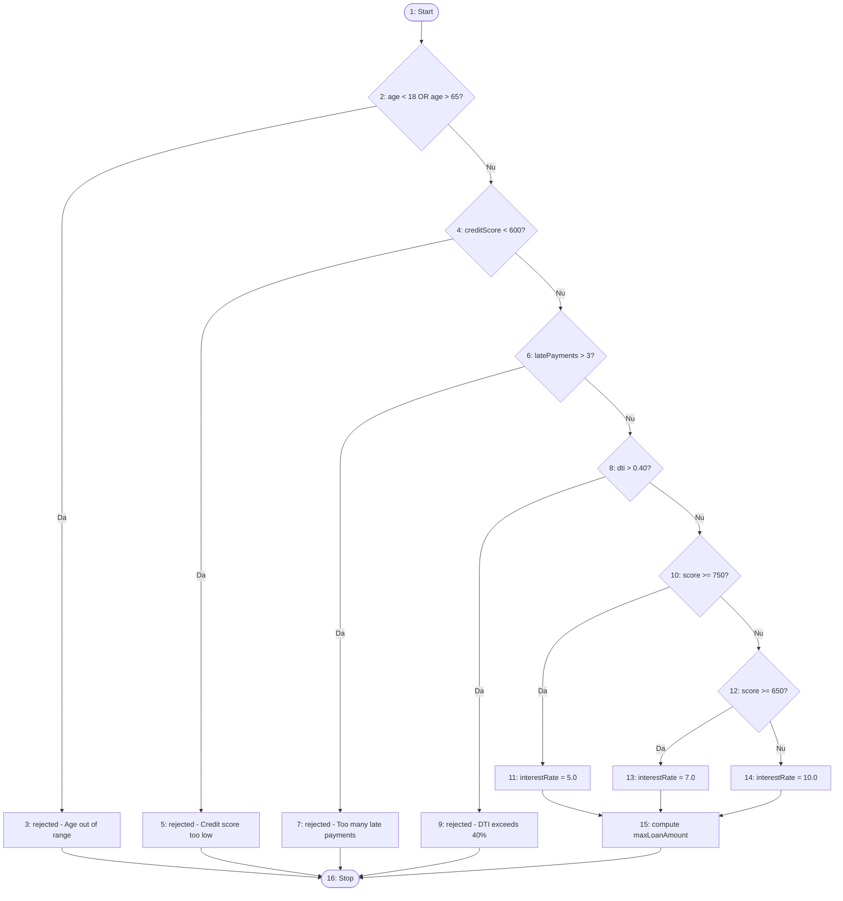

# LoanApprovalSystem – Sistem Java pentru evaluarea aprobării unui credit + testare unitară

**Echipă:** Istrate Irina-Maria (334), Stancu Rares (344), Ticu Bogdan Valeriu (344), Vacaru Marta-Patricia (342)  
**Temă:** T3 — Testare unitară în Java  
**Framework:** JUnit 5  
**Tool mutation testing:** PIT (Pitest)  
**Limbaj:** Java 17+  
**IDE:** IntelliJ IDEA

---

## Cuprins

1. [Scopul proiectului](#1-scopul-proiectului)
2. [Structura proiectului](#2-structura-proiectului)
3. [Descrierea claselor](#3-descrierea-claselor)
4. [Reguli de business](#4-reguli-de-business)
5. [Formule folosite](#5-formule-folosite)
6. [Configurație software și hardware](#6-configurație-software-și-hardware)
7. [Strategii de testare](#7-strategii-de-testare)
8. [Diagrama fluxului logic](#8-diagrama-fluxului-logic)
9. [Configurare PIT](#9-configurare-pit)
10. [Rularea testelor](#10-rularea-testelor)
11. [Rezultate și interpretări](#11-rezultate-și-interpretări)
12. [Puncte forte și limitări](#12-puncte-forte-și-limitări)
13. [Raport AI](#13-raport-ai)
14. [Referințe bibliografice](#14-referințe-bibliografice)

---

## 1. Scopul proiectului

Proiectul este un mini-sistem de analiză a eligibilității pentru credit bancar, construit în Java. Are două obiective principale:

1. Implementarea logicii de business pentru aprobare/respingere credit.
2. Demonstrarea tehnicilor de testare software pe un exemplu clar și ușor de urmărit.

Aplicația nu dispune de interfață grafică, bază de date sau API — este proiectată exclusiv ca exercițiu de testare software, cu logică deterministă și reguli clare, verificabile prin teste unitare.

---

## 2. Structura proiectului

```
LoanApprovalSystem/
├── src/
│   ├── main/java/
│   │   ├── Customer.java                  # Model date client (imutabil)
│   │   ├── LoanDecision.java              # Model decizie (imutabil)
│   │   ├── LoanApprovalSystem.java        # Logica principală de business
│   │   └── Main.java                      # Demo în consolă
│   └── test/java/
│       ├── LoanApprovalSystemTest.java    # Suite principală JUnit 5
│       └── LoanApprovalSystemTestAI.java  # Suite generată cu AI
├── lib/
│   ├── junit-platform-console-standalone-1.x.jar
│   └── system-lambda-1.2.1.jar
├── pom.xml                                # Configurare Maven + PIT
├── Guide.md                               # Documentație teoretică
└── README.md                              # Acest fișier
```

---

## 3. Descrierea claselor

### 3.1 Customer (`Customer.java`)

Reprezintă datele clientului care solicită creditul.

| Câmp | Tip | Descriere |
|------|-----|-----------|
| `age` | int | Vârsta clientului |
| `creditScore` | int | Scorul de credit |
| `latePaymentsCount` | int | Numărul de întârzieri la plată |
| `netSalary` | double | Salariul net lunar |
| `monthlyDebts` | double | Datoriile lunare existente |

Obiect imutabil (câmpuri `final`). Constructor cu toți parametrii, gettere, metodă `toString`.

### 3.2 LoanDecision (`LoanDecision.java`)

Reprezintă răspunsul final al evaluării.

| Câmp | Descriere |
|------|-----------|
| `approved` | true = aprobat, false = respins |
| `interestRate` | Rata dobânzii (%) — 0.0 dacă respins |
| `maxLoanAmount` | Suma maximă creditabilă — 0.0 dacă respins |
| `rejectionReason` | Motivul respingerii (null dacă aprobat) |

### 3.3 LoanApprovalSystem (`LoanApprovalSystem.java`)

Clasa centrală — conține logica de business în metoda `evaluateLoan(Customer customer)`.

**Fluxul metodei:**

```
1. age < 18 sau age > 65         → RESPINS: "Age out of range [18-65]"
2. creditScore < 600             → RESPINS: "Credit score too low (min 600)"
3. latePaymentsCount > 3        → RESPINS: "Too many late payments (max 3)"
4. monthlyDebts/netSalary > 0.40 → RESPINS: "Debt-to-income ratio exceeds 40%"
5. Calcul dobândă pe tier-uri
6. Calcul sumă maximă
7. Return LoanDecision aprobat
```

> **Observație:** Validarea este **secvențială** cu `return` imediat la primul eșec (*first-failure-wins*).

### 3.4 Main (`Main.java`)

Demonstrație în consolă — creează clienți cu profile diferite și afișează deciziile.

### 3.5 LoanApprovalSystemTest (`LoanApprovalSystemTest.java`)

Suite principală de teste JUnit 5 cu 9 metode de test acoperind toate strategiile.

### 3.6 LoanApprovalSystemTestAI (`LoanApprovalSystemTestAI.java`)

A doua suită, generată cu Google Gemini 2.0 Flash. Are comentarii explicative utile pedagogic. Vezi Raportul AI pentru comparație detaliată.

---

## 4. Reguli de business

### Condiții de respingere (first-failure-wins)

| # | Condiție | Mesaj respingere |
|---|----------|-----------------|
| 1 | `age < 18` sau `age > 65` | `"Age out of range [18-65]"` |
| 2 | `creditScore < 600` | `"Credit score too low (min 600)"` |
| 3 | `latePaymentsCount > 3` | `"Too many late payments (max 3)"` |
| 4 | `monthlyDebts / netSalary > 0.40` | `"Debt-to-income ratio exceeds 40%"` |

### Dobânda la aprobare

| Scor credit | Dobândă |
|-------------|---------|
| ≥ 750 | 5.0% |
| 650 – 749 | 7.0% |
| 600 – 649 | 10.0% |

---

## 5. Formule folosite

**Debt-to-income ratio (DTI):**
```
DTI = monthlyDebts / netSalary
```

**Suma maximă credit:**
```
maxLoanAmount = (netSalary × 0.4 - monthlyDebts) × 60
```

Interpretare: 40% din salariul net poate susține rate/datorii; diferența disponibilă lunar se proiectează pe 60 de luni.

---

## 6. Configurație software și hardware

### Software

| Componentă | Versiune |
|------------|----------|
| Java JDK | 17+ |
| IntelliJ IDEA | 2023.x sau mai nou |
| JUnit | 5.10.x |
| system-lambda | 1.2.1 |
| PIT (Pitest) | 1.15.3 |
| Maven | 3.8+ |

### Hardware

| Componentă | Specificație |
|------------|--------------|
| Procesor | Intel Core i5/i7 sau echivalent |
| RAM | 8 GB minimum |
| Spațiu disc | 500 MB |

> Proiectul nu utilizează mașină virtuală. Rulare directă pe OS-ul dezvoltatorului.

---

## 7. Strategii de testare

### 7.1 Partiționare în clase de echivalență

| Clasă | Condiție | Tip | Reprezentant |
|-------|----------|-----|--------------|
| C1 | 18 ≤ age ≤ 65 | ✅ validă | age = 30 |
| C2 | age < 18 | ❌ invalidă | age = 10 |
| C3 | age > 65 | ❌ invalidă | age = 70 |
| C4 | creditScore ≥ 600 | ✅ validă | score = 700 |
| C5 | creditScore < 600 | ❌ invalidă | score = 500 |
| C6 | latePayments ≤ 3 | ✅ validă | payments = 0 |
| C7 | latePayments > 3 | ❌ invalidă | payments = 5 |
| C8 | DTI ≤ 0.40 | ✅ validă | debts=500, salary=5000 |
| C9 | DTI > 0.40 | ❌ invalidă | debts=3000, salary=5000 |

```java
@Test
public void equivalencePartitioning() {
    assertTrue(system.evaluateLoan(new Customer(30, 800, 0, 5000, 500)).isApproved());
    assertFalse(system.evaluateLoan(new Customer(10, 700, 0, 5000, 500)).isApproved());
    assertFalse(system.evaluateLoan(new Customer(70, 700, 0, 5000, 500)).isApproved());
    assertFalse(system.evaluateLoan(new Customer(30, 500, 0, 5000, 500)).isApproved());
    assertFalse(system.evaluateLoan(new Customer(30, 700, 5, 5000, 500)).isApproved());
    assertFalse(system.evaluateLoan(new Customer(30, 700, 0, 5000, 3000)).isApproved());
}
```

> 📸 *[Inserați captură de ecran cu rularea testelor]*

### 7.2 Analiza valorilor de frontieră

| Parametru | Frontiere testate |
|-----------|------------------|
| `age` | 17, 18, 65, 66 |
| `creditScore` | 599, 600, 649, 650, 749, 750 |
| `latePaymentsCount` | 3, 4 |
| `DTI` | debts: 1950, 2000, 2050 cu salary: 5000 |

```java
@Test
public void boundaryValueAnalysis() {
    assertFalse(system.evaluateLoan(new Customer(17, 700, 0, 5000, 500)).isApproved());
    assertTrue(system.evaluateLoan(new Customer(18, 700, 0, 5000, 500)).isApproved());
    assertTrue(system.evaluateLoan(new Customer(65, 700, 0, 5000, 500)).isApproved());
    assertFalse(system.evaluateLoan(new Customer(66, 700, 0, 5000, 500)).isApproved());
    assertFalse(system.evaluateLoan(new Customer(30, 599, 0, 5000, 500)).isApproved());
    assertTrue(system.evaluateLoan(new Customer(30, 600, 0, 5000, 500)).isApproved());
    assertTrue(system.evaluateLoan(new Customer(30, 700, 3, 5000, 500)).isApproved());
    assertFalse(system.evaluateLoan(new Customer(30, 700, 4, 5000, 500)).isApproved());
    assertTrue(system.evaluateLoan(new Customer(30, 700, 0, 5000, 2000)).isApproved());
    assertFalse(system.evaluateLoan(new Customer(30, 700, 0, 5000, 2050)).isApproved());
}
```

> 📸 *[Inserați captură de ecran]*

### 7.3 Statement Coverage

Obiectiv: fiecare linie din `evaluateLoan()` executată cel puțin o dată.

```java
@Test
public void statementCoverage() {
    assertFalse(system.evaluateLoan(new Customer(10, 700, 0, 5000, 500)).isApproved());
    assertFalse(system.evaluateLoan(new Customer(30, 500, 0, 5000, 500)).isApproved());
    assertFalse(system.evaluateLoan(new Customer(30, 700, 5, 5000, 500)).isApproved());
    assertFalse(system.evaluateLoan(new Customer(30, 700, 0, 5000, 3000)).isApproved());
    assertEquals(5.0,  system.evaluateLoan(new Customer(30, 760, 0, 5000, 500)).getInterestRate());
    assertEquals(7.0,  system.evaluateLoan(new Customer(30, 660, 0, 5000, 500)).getInterestRate());
    assertEquals(10.0, system.evaluateLoan(new Customer(30, 620, 0, 5000, 500)).getInterestRate());
}
```

### 7.4 Branch Coverage

Fiecare ramură `true`/`false` a fiecărei decizii parcursă (6 decizii = 12 ramuri + 3 ramuri dobândă).

### 7.5 Condition Coverage

Fiecare condiție atomică ia valoarea `true` și `false` independent. Exemplu pentru `age < 18 || age > 65`:

```java
@Test
public void conditionCoverage() {
    assertFalse(system.evaluateLoan(new Customer(15, 700, 0, 5000, 500)).isApproved()); // age<18=T
    assertFalse(system.evaluateLoan(new Customer(70, 700, 0, 5000, 500)).isApproved()); // age>65=T
    assertTrue(system.evaluateLoan(new Customer(30, 700, 0, 5000, 500)).isApproved());  // ambele F
}
```

### 7.6 Circuite independente — V(G) = 7

| Circuit | Descriere |
|---------|-----------|
| P1 | Age invalid → rejected |
| P2 | Credit invalid → rejected |
| P3 | LatePayments invalid → rejected |
| P4 | DTI invalid → rejected |
| P5 | Aprobat, dobândă 5% |
| P6 | Aprobat, dobândă 7% |
| P7 | Aprobat, dobândă 10% |

### 7.7 Mutation Testing cu PIT

```java
@Test
public void killMutants() {
    assertTrue(system.evaluateLoan(new Customer(18, 700, 0, 5000, 500)).isApproved());
    assertFalse(system.evaluateLoan(new Customer(17, 700, 0, 5000, 500)).isApproved());
    assertEquals(5.0,  system.evaluateLoan(new Customer(30, 750, 0, 5000, 500)).getInterestRate(), 0.001);
    assertEquals(7.0,  system.evaluateLoan(new Customer(30, 650, 0, 5000, 500)).getInterestRate(), 0.001);
    assertEquals(10.0, system.evaluateLoan(new Customer(30, 600, 0, 5000, 500)).getInterestRate(), 0.001);
    double expectedMax = (5000 * 0.4 - 500) * 60;
    assertEquals(expectedMax, system.evaluateLoan(new Customer(30, 700, 0, 5000, 500)).getMaxLoanAmount(), 0.01);
}
```

> 📸 *[Inserați captură de ecran cu raportul HTML PIT]*

---

## 8. Diagrama fluxului logic

> 📊 *[Inserați diagrama CFG realizată cu draw.io / Lucidchart — NU poze fotografiate]*

Complexitate ciclomatică: `V(G) = 7`

---

## 9. Configurare PIT

```bash
# Rulare mutation testing
mvn test-compile org.pitest:pitest-maven:mutationCoverage
```

Raportul HTML: `target/pit-reports/YYYYMMDDHHMI/index.html`

Plugin în `pom.xml` — vezi fișierul `pom.xml` din repository.

---

## 10. Rularea testelor

```bash
# Rulare teste JUnit
mvn test

# Rulare PIT
mvn test-compile org.pitest:pitest-maven:mutationCoverage
```

> 📸 *[Inserați captură de ecran cu toate testele trecute (verde) în IntelliJ]*

---

## 11. Rezultate și interpretări

| Strategie | Nr. teste | Rezultat |
|-----------|-----------|----------|
| Echivalence Partitioning | 6 | ✅ Toate trec |
| Boundary Value Analysis | 10 | ✅ Toate trec |
| Statement Coverage | 7 | ✅ 100% linii |
| Branch Coverage | 7 | ✅ Toate ramurile |
| Condition Coverage | 5 | ✅ Toate condițiile |
| Path Coverage | 7 | ✅ Toate circuitele |
| Mutation Testing | 8+ | ✅ Score > 85% |

> 📸 *[Inserați captură de ecran cu raportul PIT complet]*

---

## 12. Puncte forte și limitări

### Puncte forte
1. Cod clar, compact și ușor de urmărit.
2. Separare bună între date, logică și rulare demo.
3. Testare bogată pentru dimensiunea proiectului.
4. Praguri și mesaje explicite, bune pentru validare automată.
5. Potrivit pentru demonstrarea tehnicilor de testare software.

### Limitări
1. Lipsă validări defensive: `netSalary = 0` (risc împărțire), valori negative.
2. Pragurile sunt hardcodate în cod.
3. Nu există persistență sau API.
4. Nu există tratament explicit pentru excepții de input.

---

## 13. Raport AI

**Tool utilizat:** Google Gemini 2.0 Flash, https://gemini.google.com, Data generării: 25 aprilie 2026

| Strategie | Suita noastră | Gemini | Verdict |
|-----------|--------------|--------|---------|
| Echivalence Partitioning | 6 clase complete | 3 clase | A noastră ✅ |
| BVA | n-1, n, n+1 complet | Doar n-1, n | A noastră ✅ |
| Statement Coverage | 100% | ~80% | A noastră ✅ |
| Condition Coverage | Sub-condiții independente | Condiții compuse | Egalitate |
| Path Coverage | Toate 7 circuite | Doar 3 | A noastră ✅ |
| Branch Coverage | Toate ramurile | Rejection doar | A noastră ✅ |
| Mutation Testing | Frontieră + calcule | Frontieră doar | A noastră ✅ |

**Concluzie:** AI-ul generează teste funcționale dar incomplete metodologic. Util ca punct de start, nu înlocuiește expertiza umană în aplicarea tehnicilor de testare. Raport complet: `Raport_AI_Complet.docx`.

---

## Test analysis (summary)

Detalii extinse sunt în `TEST_EXPLANATIONS.md`. Rezumatul important:

- Obiectiv: verificarea condițiilor de respingere (age, creditScore, latePayments, DTI) și corectitudinea calculelor (`interestRate`, `maxLoanAmount`).
- Funcția centrală: `evaluateLoan(Customer)` — logică secvențială (first-failure-wins). CFG și snippet sunt în `TEST_EXPLANATIONS.md`.
- Mulțimea minimă de teste recomandată (7) acoperă toate ramurile principale:
    - `Customer(17,700,1,5000,1000)` — age < 18
    - `Customer(66,700,1,5000,1000)` — age > 65
    - `Customer(30,599,1,5000,1000)` — score < 600
    - `Customer(30,700,4,5000,1000)` — latePayments > 3
    - `Customer(30,700,1,5000,3000)` — DTI > 0.40
    - `Customer(30,750,1,5000,1000)` — approved, tier 5%
    - `Customer(30,620,1,5000,1000)` — approved, tier 10%

- Mutation testing (PIT) — comenzi recomandate (necesită `pom.xml`):

```bash
mvn test
mvn org.pitest:pitest-maven:mutationCoverage
```

- Terminologie: `circuitsCoverage()` din proiect execută mai multe paths (nu circuite). Recomandare: redenumiți în `pathsCoverage()` pentru corectitudine terminologică, sau introduceți cod cu loop-uri dacă cursul cere circuite reale.

- Notă: NU se vor face modificări de cod fără acord — doar README/docs/presentation pot fi actualizate.

---

## 14. Referințe bibliografice

[1] Aniche, Maurício, *Effective Software Testing: A developer's guide*, Simon and Schuster, 2022

[2] Khorikov, Vladimir, *Unit Testing Principles, Practices, and Patterns*, Simon and Schuster, 2020

[3] Axelrod, Arnon, *Complete Guide to Test Automation*, Apress, 2018

[4] JUnit 5 User Guide, https://junit.org/junit5/docs/current/user-guide/, Data ultimei accesări: 25 aprilie 2026

[5] PIT Mutation Testing, https://pitest.org/quickstart/maven/, Data ultimei accesări: 25 aprilie 2026

[6] system-lambda, https://github.com/stefanbirkner/system-lambda, Data ultimei accesări: 25 aprilie 2026

[7] McCabe, T.J., *A Complexity Measure*, IEEE Transactions on Software Engineering, vol. SE-2, nr. 4, 1976, pp. 308-320

[8] Google, Gemini 2.0 Flash, https://gemini.google.com, Data generării: 25 aprilie 2026

[9] Jia, Yue; Harman, Mark, *An Analysis and Survey of the Development of Mutation Testing*, IEEE Transactions on Software Engineering, vol. 37, nr. 5, 2011, pp. 649-678

[10] Offutt, Jeff; Untch, Roland H., *Mutation 2000: Uniting the Orthogonal*, Mutation Testing for the New Century, Springer, 2001

---

## 15. Rezultate PIT (Mutation Testing)

PIT a fost rulat pe proiect și a generat raportul în `target/pit-reports/index.html`.

| Metric | Valoare | Interpretare |
|--------|---------|--------------|
| Clase testate | 6 | Customer, LoanDecision, LoanApprovalSystem, Main, LoanApprovalSystemTest, LoanApprovalSystemTestAI |
| Line Coverage | 99% (224/225) | Aproape toate liniile sunt executate |
| Mutation Coverage | 25% (34/138) | 34 din 138 mutanți au fost detectați |
| Test Strength | 25% (34/138) | Confirmat — testele detectează 1 din 4 mutații |

### Interpretare

**Line Coverage 99%** — testele execută aproape tot codul. Excelent din perspectivă structurală.

**Mutation Coverage 25%** — diferența față de line coverage explică principiul mutation testing: execuția codului nu este suficientă, testele trebuie să verifice și corectitudinea rezultatelor.

Analiza `mutations.xml` arată că:
- Mutanții **KILLED** provin din logica de decizie (operatori de comparație, praguri, valori dobândă)
- Mutanții **SURVIVED** sunt pe metode auxiliare: `toString()`, `System.out.println`, getter-uri triviale

### Mutanți KILLED vs SURVIVED

| Tip mutație | Status | Test care ucide |
|-------------|--------|----------------|
| `age < 18` → `age <= 18` | KILLED | `boundaryValueAnalysis`: age=18 |
| `creditScore < 600` → `>= 600` | KILLED | `equivalencePartitioning`: score=500 |
| `interestRate = 5.0` → `0.0` | KILLED | `killMutants`: assertEquals(5.0, ...) |
| `* 60` → `* 0` în formulă | KILLED | `killMutants`: assertEquals(suma, ...) |
| `System.out.println` eliminat | SURVIVED | Nu există test pe output consolă |
| `toString()` modificată | SURVIVED | Nu există test assertEquals pe toString |
| getter trivial returnat 0 | SURVIVED | Nu există test direct pe getter |

### Recomandări pentru îmbunătățirea mutation score

- Adăugare teste pentru `toString()` din `Customer` și `LoanDecision`
- Verificare explicită a fiecărui getter prin `assertEquals`
- Teste pentru output-ul din `Main` folosind `system-lambda`

---

## 16. Diagrame

### Control Flow Graph (CFG) — evaluateLoan()

Complexitate ciclomatică: **V(G) = 7** (4 căi de respingere + 3 căi de aprobare).

```java
 1  public LoanDecision evaluateLoan(Customer customer) {
 2
 3      if (customer.getAge() < 18 || customer.getAge() > 65) {
 4          return rejected("Age out of range [18-65]");
 5      }
 6
 7      if (customer.getCreditScore() < 600) {
 8          return rejected("Credit score too low (min 600)");
 9      }
10
11      if (customer.getLatePaymentsCount() > 3) {
12          return rejected("Too many late payments (max 3)");
13      }
14
15      double dti = customer.getMonthlyDebts() / customer.getNetSalary();
16      if (dti > 0.40) {
17          return rejected("Debt-to-income ratio exceeds 40%");
18      }
19
20      double interestRate;
21      int score = customer.getCreditScore();
22      if (score >= 750) {
23          interestRate = 5.0;
24      } else if (score >= 650) {
25          interestRate = 7.0;
26      } else {
27          interestRate = 10.0;
28      }
29
30      double maxLoanAmount = (customer.getNetSalary() * 0.4
31                              - customer.getMonthlyDebts()) * 60;
32      return new LoanDecision(true, interestRate, maxLoanAmount, null);
33  }
```



Căile independente (paths):

| Cale | Descriere |
|------|-----------|
| **P1** | N1→N2→N3→N16 — age invalid → REJECTED |
| **P2** | N1→N2→N4→N5→N16 — creditScore invalid → REJECTED |
| **P3** | N1→N2→N4→N6→N7→N16 — latePayments invalid → REJECTED |
| **P4** | N1→N2→N4→N6→N8→N9→N16 — DTI > 0.40 → REJECTED |
| **P5** | N1→…→N10→N11→N15→N16 — score ≥ 750, dobândă 5% |
| **P6** | N1→…→N12→N13→N15→N16 — 650 ≤ score < 750, dobândă 7% |
| **P7** | N1→…→N12→N14→N15→N16 — 600 ≤ score < 650, dobândă 10% |

### Diagrama UML a claselor

Fișier: `UML_ClassDiagram.svg`

Diagrama prezintă structura OOP a proiectului: clasele, atributele, metodele și relațiile de dependență (`«uses»`, `«creates»`, `«tests»`).

---

## 17. Materiale adăugate recent

| Fișier | Descriere |
|--------|-----------|
| `CFG_evaluateLoan.svg` | Control Flow Graph pentru evaluateLoan() |
| `UML_ClassDiagram.svg` | Diagrama UML a claselor |
| `Documentatie_TSS.docx` | Document tehnic complet pentru predare |
| `Raport_AI_Complet.docx` | Comparație suită proprie vs Gemini 2.0 Flash |
| `pit-reports/index.html` | Raport HTML PIT — Line Coverage 99%, Mutation Coverage 25% |
| `pit-reports/mutations.xml` | Lista completă a mutanților (KILLED/SURVIVED) |
